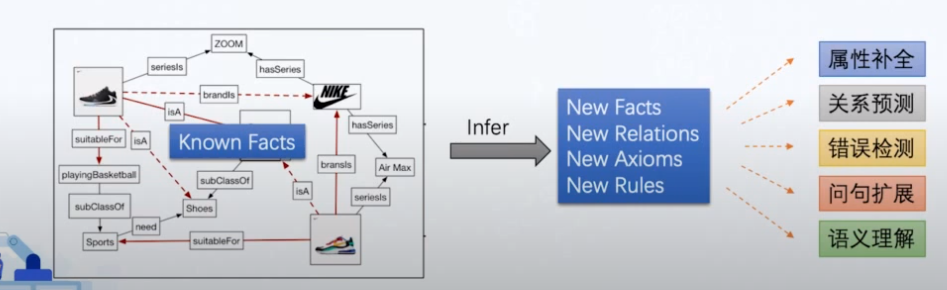
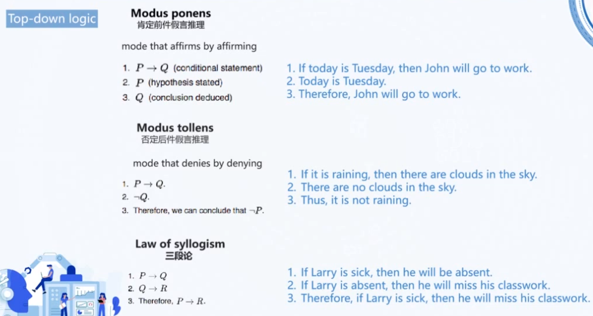

# 知识图谱推理
## 知识图谱推理的定义
* 所谓**知识推理**，是指在现有知识的基础之上，推断出未知的关系或事实的过程，或者从大量的已有知识中进行归纳，从个体知识推广到一般性的知识。
* 知识图谱中的每条三元组，均代表了关于客观世界的一条事实描述，属性补全、关系预测、错误检测等相关应用，均可归结为知识推理任务。

## 常见知识图谱推理方法分类
### 基于符号表示的推理
局限于显示表示，优势是可解释性强
* 演绎推理，如基于Onto Axioms和Datalog等方法

* 归纳推理，如PRA系列等基于图结构方法以及AIME等规则归纳学习方法，即从知识图谱中已经存在的事实和图结构，通过统计学习的方式得出一组规则，相较于演绎推理，不需要人为定义规则；但缺点是需要对整个图谱进行搜索匹配，随KG增大，复杂度迅速增加
### 基于向量表示的方法
已于表示隐式知识，但缺乏可解释性
* 知识图谱嵌入系列模型，如TransE等模型，先将三元组投影到向量空间，从而将推理计算转化为向量间计算，但这一过程丢失了可解释性。
* 基于图神经网络的推理，利用GNN在结构学习上的强大性能，为图谱推理获得更多图结构方面得特征，但图谱稀疏性问题更加突出
* Ontology Embedding
* 基于向量的规则学习，如IterE，NeuralLP等

### 基于嵌入学习的知识图谱推理
知识图谱上的关系推理可以归结为三种类型：
* Predicting the missing link
  - Given e1 and e2, predict the relation r.
* Predicting the misssing entity
  - Given e1 and relaiton r, predict the missing entity e2.
* Fact Prediction
  - Given a triplet, predict whether it is true or false.

以TransE为例，要求头实体、关系实体和尾实体间存在h+r=t的关系，通过大量的训练语料，学习得到节点嵌入表示；当新的三元组或实体或关系出现时，进行预测。
